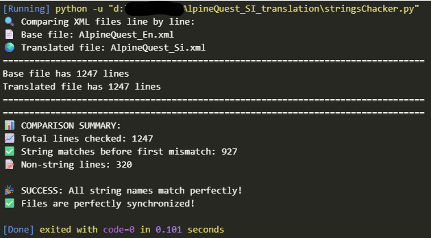
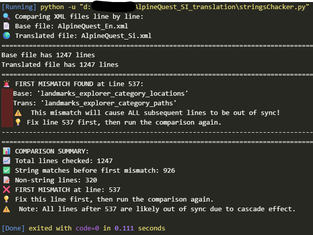

Slovenian translation support for [AlpineQuest](https://www.alpinequest.net/) app. Simply the best outdoor navigation app you can get for your Android.


**Disclaimer**
*I've invented some new Slovenian words because we do not have a meaningful translation. Or there are multiple words with the same meaning. I decided to choose the ones that are most logical.I'm not a geographer or translator so if any of my Slovenian colleagues is upset about a certain translation please feel free to suggest a better solution and I will push new better translations ASAP.*

| EN ! | SI ? | SI 👍 |
| ----------- | ----------- | ----------- |
| Route | ~~ruta~~ | pot    |
| Waypoint | smerna točka ali kažipot 🤔 |  smerna točka    |
| Path | pot|  pot    |
| Track | sled | sled  |
| Track segment | odsek sledi  |      |
| Placemark | ~~geopodatek~~ 🤷 |  krajevna oznaka   |
| Landmark | mestna oznaka - znamenitost 🤷‍♂️|      |


# NEW ADDON - XML String Checker

A Python script to compare two XML files and verify that all string names match line by line.
Perfect for ensuring translated XML file maintain the same string structure as the original.

## Features

- **Line-by-line comparison** - Checks string names at exact line positions
- **Cascade detection** - Stops after first mismatch to avoid redundant warnings
- **Multiple file support** - Handles comments, HTML tags, and non-string content
- **Clear reporting** - Shows exact line numbers and actionable fixes

## Usage

1. Prepare your files:
   - `AlpineQuest_En.xml` - Base English strings file
   - `AlpineQuest_Si.xml` - Translated strings file

2. Run the script:
   ```python stringsChacker.py```

3. Fix any reported mismatches and run again until all strings match.

## Output Examples


*Perfect match - all strings synchronized*


*First mismatch detected with line number*

[](https://alpinequest.net/#don_t_wait_try_it_right_now)


